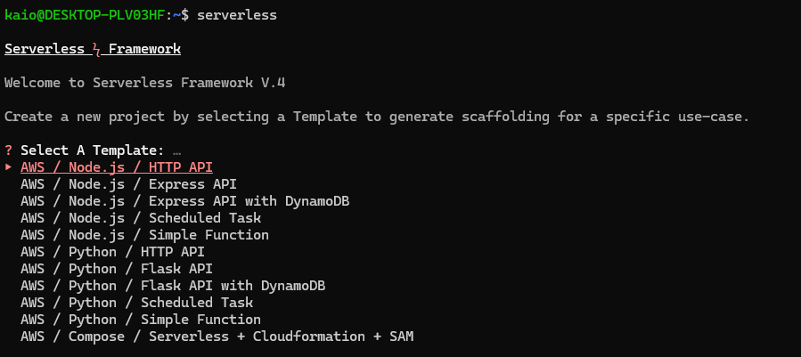
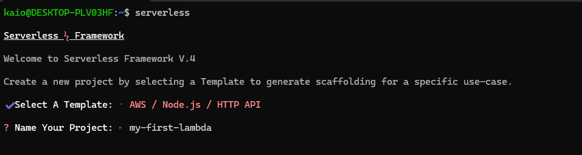
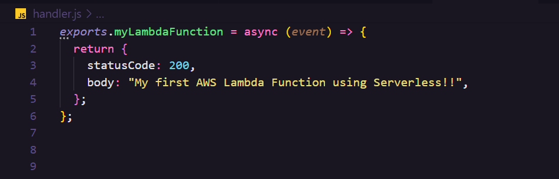

# SMS LAMBDA

AWS lambda to send SMS

## Creating an AWS Lambda Function with Serverless Framework and API Gateway Integration

This guide provides step-by-step instructions to create an AWS Lambda Function using the Serverless Framework integrated with AWS API Gateway.

## Prerequisites

- AWS Account
- NodeJS (LTS)

## Step-by-step guide

### 1. Setting up your AWS Credentials

1. To deploy cloud infrastructure to AWS, you must give the Serverless Framework access to your AWS credentials.

   This topic describes how to install or update the latest release of the AWS Command Line Interface (AWS CLI) on supported operating systems. Follow the steps described in the [link](https://docs.aws.amazon.com/cli/latest/userguide/getting-started-install.html) to install and set the AWS CLI on your Computer

   If you prefer, you can follow the step-by-step described in this [Serverless tutorial](https://www.serverless.com/framework/docs/getting-started)

### 2. Setting Up Serverless Framework With AWS

1. Here's how to install the Serverless Framework, set up a project and deploy it to Amazon Web Services on serverless infrastructure like AWS Lambda, AWS DynamoDB, AWS S3 and more.

2. First, you must have the Node.js runtime installed, then you can install the Serverless Framework via NPM.

3. Open your CLI and run the command below to install the Serverless Framework globally

   ```bash
   npm install serverless -g

   #or

   yarn add serverless -g
   ```

4. Run `serverless` to verify your installation is working, and show the current version

### 3. Creating a Serverless project

1. After you have installed the Serverless Framework successfully in your computer, it is time to create a new Serverless project. First, go to the folder you want to create the new project and type the command bellow:

   ```bash
   serverless
   ```

2. The command above will show you several Templates. Choose one that fits the language and use-case you want.

   

3. After choosing a project template, give a name to your project:

   

4. Please use only lowercase letters, numbers and hyphens. Also, keep Service names short, since they are added into the name of each cloud resource the Serverless Framework creates, and some cloud resources have character length restrictions in their names.

5. Wait until the project template download. When it finishes, open the project folder using your preferred Code Editor.

### 4. Signing in

1. if you are using the serverless command to set up a Service, it will eventually ask you to log in. If you need to log in outside of that, run `serverless login`.

2. Logging in will redirect you to the Serverless Framework Dashboard within your browser. Choose the login option and type your credentials:

   <center>

   ### Serverless Credentials

   |     Email      |   Password   |
   | :------------: | :----------: |
   | your@email.com | yourPassword |

   </center>
   </br>

3. After login successfully, we are ready to following the next step.

### 5. Developing an AWS Lambda Function

1. Now that we have a scaffolding project created, create the function you want to be used in the AWS Lambda Function.



**OBS: In NodeJS projects, it is important to export the function using the keyword `exports.<myLambdaFunction>` in the `handler.js` file**

### 6. Deploying your AWS Lambda Function

1. Now that we have our function created, it is time to deploy our AWS Lambda. Open the `serverless.yml` file on the root folder and edit it following the list of available properties. You can see the list of all available properties in the [link](https://www.serverless.com/framework/docs/providers/aws/guide/serverless.yml#root-properties)

2. Here is a list of some available properties in `serverless.yml` when the provider is set to `aws`.

   ```yml
   org: organizationName                     # Name of the organization
   service: serviceName                      # Name of the service you are creating

   provider:
      # Name of provider (e.g. aws)
      name: providerName

      # Default region. Optional. (default: us-east-1)
      region: us-east-1

      # The httpApi settings apply to API Gateway v2 HTTP APIs. If you are looking for the API Gateway v1 REST API, follow the instructions on https://www.serverless.com/framework/docs/providers/aws/guide/serverless.yml#api-gateway-v1-rest-api
      httpApi:
         # ID of the API Gateway v2 (HTTP), if not provided serverless will create a new API Gateway
         id: xxxxxxxxxxxxx

         # Set a custom name for the API Gateway API (default: ${sls:stage}-${self:service})
         name: YourAPIGatewayName

         # Payload format version (note: use quotes in YAML: '1.0' or '2.0') (default: '2.0')
         payload: '2.0'

         # Disable the default 'execute-api' HTTP endpoint (default: false)
         # Useful when using a custom domain.
         disableDefaultEndpoint: true

         # Enable detailed CloudWatch metrics (default: false)
         metrics: true

         # Enable CORS HTTP headers with default settings (allow all)
         # Can be fine-tuned with specific options
         cors: true

      # The runtime of the service (e.g. nodejs20.x)
      runtime: runtimeName

      # Default memory size for functions. Optional. (default: 1024MB).
      memorySize: 512

      # Default timeout for functions. Optional. (default: 6 seconds).
      # Note: API Gateway has a maximum timeout of 30 seconds
      timeout: 10

      # Default stage. Optional. (default: dev)
      stage: ${env:STAGE}

      # AWS Lambda Environment Variables for all functions. Optional.
      environment:
         PROJECT_ENV_1: ${env:PROJECT_ENV_1}
         PROJECT_ENV_2: ${env:PROJECT_ENV_2}

      # Duration for CloudWatch log retention. Optional. (default: forever).
      # Can be overridden for each function separately inside the functions block, see below on page.
      # Valid values: https://docs.aws.amazon.com/AWSCloudFormation/latest/UserGuide/aws-resource-logs-loggroup.html
      logRetentionInDays: 14

      # Use AWS Lambda function versioning. Optional. (enabled by default)
      versionFunctions: true

      # AWS Lambda Processor architecture: 'x86_64' or 'arm64' via Graviton2. Optional. (default: x86_64)
      architecture: x86_64

      # Configure IAM roles and permissions applied to Lambda functions (complete documentation)
      iam:
         # Instruct Serverless to use an existing IAM role for all Lambda functions
         role: arn:aws:iam::XXXXXX:role/role

         # OR configure the role that will be created by Serverless (simplest):
         role:
            # Add statements to the IAM role to give permissions to Lambda functions
            statements:
            - Effect: Allow
               Action:
                  - 's3:ListBucket'
               Resource:
                  Fn::Join:
                  - ''
                  - - 'arn:aws:s3:::'
                     - Ref: ServerlessDeploymentBucket

            # Optional custom name for default IAM role
            name: your-custom-name-role

            # Optional custom path for default IAM role
            path: /your-custom-path/

            # Optional IAM Managed Policies to include into the IAM Role
            managedPolicies:
            - arn:aws:iam:*****:policy/some-managed-policy

            # ARN of a Permissions Boundary for the role
            permissionsBoundary: arn:aws:iam::XXXXXX:policy/policy

            # CloudFormation tags
            tags:
            key: value

         # ARN of an IAM role for CloudFormation service. If specified, CloudFormation uses the role's credentials
         deploymentRole: arn:aws:iam::XXXXXX:role/role

      # Optional CF stack policy to restrict which resources can be updated/deleted on deployment
      # The example below allows updating all resources in the service except deleting/replacing EC2 instances (use with caution!)
      stackPolicy:
         - Effect: Allow
            Principal: '*'
            Action: 'Update:*'
            Resource: '*'
         - Effect: Deny
            Principal: '*'
            Resource: '*'
            Action:
            - Update:Replace
            - Update:Delete
            Condition:
            StringEquals:
               ResourceType:
                  - AWS::EC2::Instance

      # Serverless Framework needs an AWS S3 bucket to store artifacts for deploying.
      # That bucket is automatically created and managed by Serverless, but you can configure it explicitly if needed:

      # The S3 prefix under which deployed artifacts are stored. Optional. (default: serverless)
      deploymentPrefix: serverless

      # Configure the S3 bucket used by Serverless Framework to deploy code packages to Lambda. Optional.
      deploymentBucket:
         # Name of an existing bucket to use. Optional. (default: created by serverless)
         name: com.serverless.${self:provider.region}.deploys

         # On deployment, serverless prunes artifacts older than this limit (default: 5)
         maxPreviousDeploymentArtifacts: 10

         # Prevents public access via ACLs or bucket policies (default: false)
         # Note: the deployment bucket is not public by default. These are additional ACLs.
         blockPublicAccess: true

         # Skip the creation of a default bucket policy when the deployment bucket is created (default: false)
         skipPolicySetup: true

         # Enable bucket versioning (default: false)
         versioning: true

         # Server-side encryption method
         serverSideEncryption: AES256

         # For server-side encryption
         sseKMSKeyId: arn:aws:kms:us-east-1:xxxxxxxxxxxx:key/aaaaaaaa-aaaa-aaaa-aaaa-aaaaaaaaaaaa

         # For server-side encryption with custom keys
         sseCustomerAlgorithim: AES256
         sseCustomerKey: string
         sseCustomerKeyMD5: md5sum

         # Tags that will be added to each of the deployment resources
         tags:
            key1: value1
            key2: value2

      # The serverless package or serverless deploy commands package the code of all functions into zip files. These zip files are then used for deployments.
      # Optional deployment packaging configuration
   package:
      # Directories and files to include in the deployed package
   patterns:
      - src/**
      - handler.js
      - '!.git/**'
      - '!.travis.yml'

     # Package each function as an individual artifact (default: false)
   individually: true

     # Explicitly set the package artifact to deploy (overrides native packaging behavior)
   artifact: path/to/my-artifact.zip

     # Automatically exclude NPM dev dependencies from the deployed package (default: true)
   excludeDevDependencies: false

   functions:
      functionOne:
         # The file and module for this specific function. Cannot be used with 'image'.
         handler: handler.functionOne

         # Memory size (default: 1024MB)
         memorySize: 512

         # Timeout (default: 6 seconds)
         # Note: API Gateway has a maximum timeout of 30 seconds
         timeout: 10

         # Function environment variables
         environment:
            APP_ENV_VARIABLE: FOOBAR

         # Configure the size of ephemeral storage available to your Lambda function (in MBs, default: 512)
         ephemeralStorageSize: 512

         # Override the Lambda function name
         name: ${sls:stage}-lambdaName

         # Some description
         description: My function

         # Processor architecture: 'x86_64' or 'arm64' via Graviton2 (default: x86_64)
         architecture: x86_64

         # Reserve a maximum number of concurrent instances (default: account limit)
         reservedConcurrency: 5

         # Provision a minimum number of concurrent instances (default: 0)
         provisionedConcurrency: 3

         # Override the IAM role to use for this function
         role: arn:aws:iam::XXXXXX:role/role

         # SNS topic or SQS ARN to use for the DeadLetterConfig (failed executions)
         onError: arn:aws:sns:us-east-1:XXXXXX:sns-topic

         # KMS key ARN to use for encryption for this function
         kmsKeyArn: arn:aws:kms:us-east-1:XXXXXX:key/some-hash

         # Defines if you want to make use of SnapStart, this feature can only be used in combination with a Java runtime. Configuring this property will result in either None or PublishedVersions for the Lambda function
         snapStart: true

         # Disable the creation of the CloudWatch log group
         disableLogs: false

         # Duration for CloudWatch log retention (default: forever). Overrides provider setting.
         logRetentionInDays: 14

         # Packaging rules specific to this function
         package:
            # Directories and files to include in the deployed package
            patterns:
            - src/**
            - handler.js
            - '!.git/**'
            - '!.travis.yml'

            # Explicitly set the package artifact to deploy (overrides native packaging behavior)
            artifact: path/to/my-artifact.zip

            # Package this function as an individual artifact (default: false)
            individually: true

         # ARN of Lambda layers to use
         layers:
            - arn:aws:lambda:region:XXXXXX:layer:LayerName:Y

         # Overrides the provider setting. Can be 'Active' or 'PassThrough'
         tracing: Active

         # Conditionally deploy the function
         condition: SomeCondition

         # CloudFormation 'DependsOn' option
         dependsOn:
            - MyThing
            - MyOtherThing

         # Events
         events:
            - httpApi:
               path: /v1/functionOne
               method: post

   ```

3. Once you have configured the `serverless.yml` properly, it is time to deploy the application to the AWS. Use the command bellow to finish the deploy process:

   ```bash
   serverless deploy
   ```

   **OBS: This method uses the AWS CloudFormation Stack Update. CloudFormation is slow, so this method is slower. If you want to develop more quickly use the `serverless deploy function` instead. See the sections bellow to more information.**

4. You can print the progress during the deployment if you use verbose mode, like this:

   ```bash
   serverless deploy --verbose
   ```

5. **Deploy Function**: This deployment method does not touch your AWS CloudFormation Stack. Instead, it simply overwrites the zip file of the current function on AWS. This method is much faster, since it does not rely on CloudFormation.

   ```bash
   serverless deploy function --function myFunction
   ```

   5.1 **How It Works**

   - The Framework packages up the targeted AWS Lambda Function into a zip file.
   - The Framework fetches the hash of the already uploaded function .zip file and compares it to the local .zip file hash.
   - The Framework terminates if both hashes are the same.
   - That zip file is uploaded to your S3 bucket using the same name as the previous function, which the CloudFormation stack is pointing to.

### 7. The `Serverless dev` command

1. This command activates a development session on the specified stage and region. This allows you to run, develop, and test your functions locally while they are being invoked in real-time remotely on AWS Lambda. It establishes a long-running CLI session that connects directly to your Lambda functions, waiting for events to invoke them. This method significantly simplifies the development of your functions locally, eliminating the need for deployment after every change, and allows you to work with real infrastructure without any emulation.

   ```bash
   serverless dev
   ```

### 8. Invoking a AWS Lambda Function

1. The `serverless invoke` command invokes a deployed function. You can send event data, read logs and display other important information of the function invocation.

   ```bash
   serverless invoke [local] --function functionName
   ```

2. You can send data to the function using the `--data` flag. See the example:

   ```bash
   serverless invoke --function functionName --data "hello world"
   ```

3. The example bellow will pass the json data in the lib/data.json file (relative to the root of the service) while invoking the specified/deployed function.

   ```bash
   serverless invoke --function functionName --path lib/data.json
   ```

   Example `data.json`:

   ```json
   {
     "resource": "/",
     "path": "/",
     "httpMethod": "GET"
     //  etc. //
   }
   ```

4. To more details about the serverless invoke command, see the [link.](https://www.serverless.com/framework/docs/providers/aws/cli-reference/invoke)

## Conclusion

You have successfully created a AWS Lambda Function using the Serverless Framework. Congratulations!!!

## Usage

### Invocation

You can call the created application via HTTP passing the following arguments as a `JSON`:

```bash
curl --data "toPhoneNumber=+5583999999999&bodyMessage=Message" https://xxxxxxx.execute-api.us-east-1.amazonaws.com/
```

Which should result in response similar to:

```json
{ "status": 200, "message": "Message successfully sent!!!" }
```

## Author

|                     |
| --------------------------------------------------------------------------------------- |
| <p align="center"> <a href="https://github.com/kaio-giovanni"> @kaio-giovanni </a> </p> |
